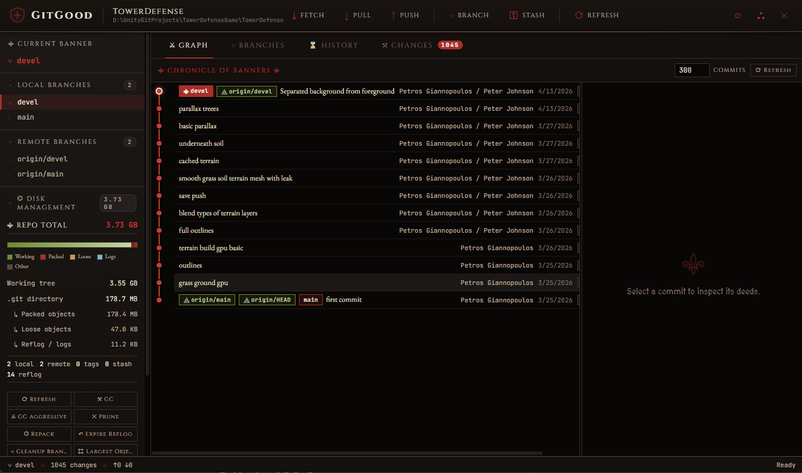
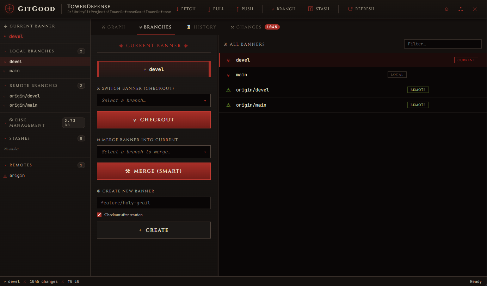
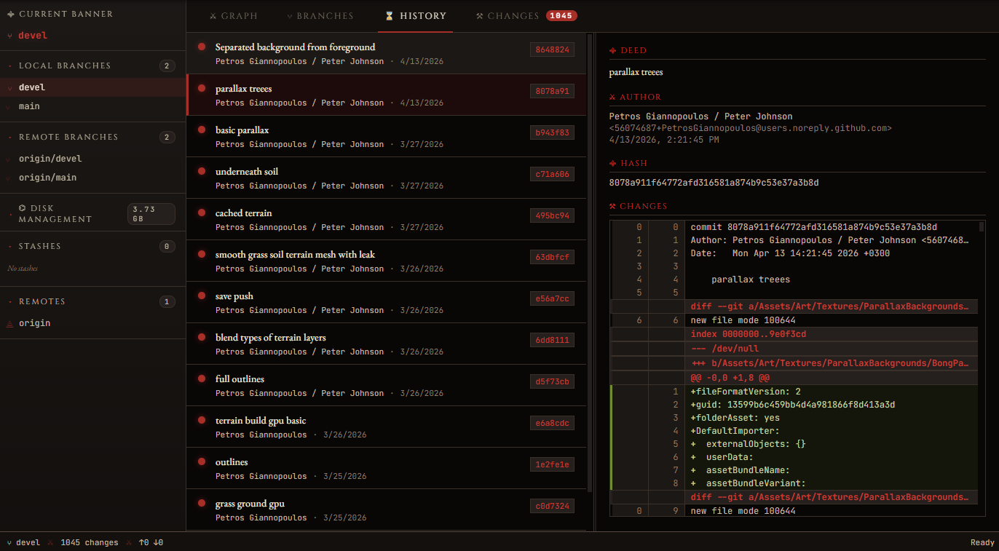
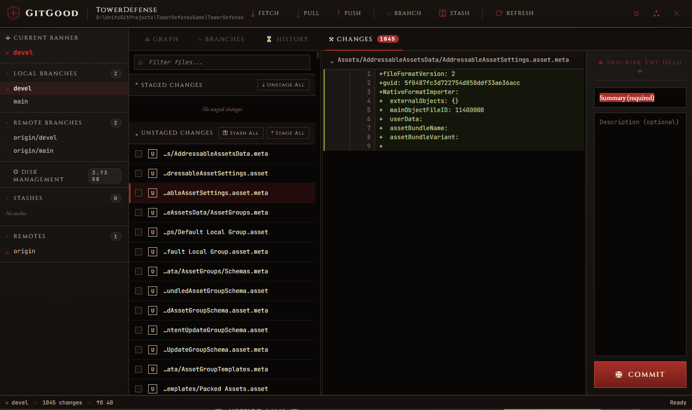

<div align="center">

<h1 style="font-size:56px; letter-spacing:4px;">GitGood</h1>

<h3>⚜ Version 1.0.2 ⚜</h3>

<p><em>A medieval-themed Git GUI client forged in the fires of the crusade.</em></p>

<br>

<p>Built with Electron and simple-git.</p>

</div>

# GitGood

> ⚜ A medieval crusader-themed Git GUI client, forged for the faithful coder ⚜

GitGood is a fully functional Electron-based Git desktop client with a medieval/crusader aesthetic (white, red, black). All standard Git terminology is preserved — only the visuals are themed.

## Features

- **Repository management**: open, init, clone repositories
- **Recent repositories** persisted across sessions
- **Full commit history** with author, date, hash, and per-commit diff
- **Stage / unstage / discard** individual files or all at once
- **Diff viewer** with syntax-highlighted additions/deletions
- **Commit** with summary + description
- **Push / pull / fetch** with badge indicators for ahead/behind counts
- **Branch operations**: create, checkout, merge, delete (and force delete)
- **Remote branches**: checkout as local
- **Stash**: create, apply, pop, drop
- **Remotes**: view, copy URL, open in browser, remove
- **Context menus** on branches, commits, files, stashes, remotes
- **Toast notifications** for all operations
- **Status bar** with current branch, change count, ahead/behind

## Prerequisites

- **Node.js 18+** (only required for initial setup / building the portable bundle)
- **Git** installed and available on `PATH` (Electron shells out to your system git via `simple-git`)

## Setup

From inside the `GitGood` folder:

```bash
npm install
```

This installs Electron and `simple-git` into `node_modules` — everything the app needs is then contained inside this folder.

## Run (development / portable)

```bash
npm start
```

That's it. The whole folder (including `node_modules`) is self-contained — you can copy it to another machine with Node installed and run `npm start` without re-installing, or build a single-file portable executable (below).

## Build a true portable .exe (Windows)

```bash
npm run build:win
```

The portable `.exe` will be created in `dist/`. It's a single file with everything bundled — no installation, no dependencies on the host machine.

For Linux:
```bash
npm run build:linux
```

For macOS:
```bash
npm run build:mac
```

## Project Structure

```
GitGood/
├── package.json              # Dependencies and build config
├── src/
│   ├── main/
│   │   ├── main.js          # Electron main process, IPC, git operations
│   │   └── preload.js       # Secure bridge to renderer
│   ├── renderer/
│   │   ├── index.html       # UI structure
│   │   ├── styles.css       # Medieval crusader theme
│   │   └── renderer.js      # All UI logic
│   └── assets/
│       └── icon.svg         # App icon
└── README.md
```

## Keyboard Shortcuts

- `Ctrl+O` — Open repository
- `Ctrl+Shift+O` — Clone repository
- `Ctrl+Enter` — Commit (when commit summary is focused)
- `Esc` — Close modal / context menu

## Tech

- **Electron 31** — desktop shell
- **simple-git** — git command wrapper
- **No frameworks** in the renderer — plain HTML/CSS/JS for fast startup
- **Cinzel + MedievalSharp + EB Garamond + JetBrains Mono** — typography

⚜ Deus vult ⚜





